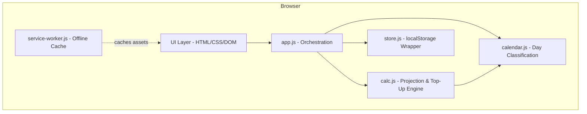

# Design Document: E-Wallet Monitor

## Overview

A lightweight, offline-first PWA for projecting monthly e-wallet expenses and calculating top-up amounts. The app is a single-user personal tool with no server component — all logic runs in the browser and all data lives in localStorage.

**Tech Stack:**
- Vanilla HTML/CSS/JS (no framework, no build tools)
- Service Worker for offline caching
- localStorage for persistence
- Static file hosting (GitHub Pages or similar)

**Design Principles:**
- Flat architecture — no deep module nesting
- Pure functions for all calculations (testable, predictable)
- Minimal abstraction — code reads like the requirements
- Single HTML entry point, JS modules loaded via `<script type="module">`

## Architecture



**File Structure:**
```
/
├── index.html          # Single page, all views
├── style.css           # All styles
├── manifest.json       # PWA manifest
├── service-worker.js   # Cache-first strategy
├── js/
│   ├── app.js          # Entry point, view routing, event wiring
│   ├── store.js        # localStorage read/write, export/import
│   ├── calendar.js     # Day type classification, holiday matching
│   ├── calc.js         # Projection, top-up, bills calculation
│   └── ui.js           # DOM rendering helpers
└── icons/              # PWA icons (192px, 512px)
```

No bundler. No transpiler. ES modules in modern browsers (Chrome 80+, Edge 80+) — both target platforms support this natively.

## Components and Interfaces

### store.js — Data Persistence

```javascript
// All functions read/write to localStorage with JSON serialization
export function load(key)           // returns parsed object or default
export function save(key, value)    // JSON.stringify and persist
export function exportAll()         // returns full data as JSON string
export function importAll(json)     // validates and replaces all data
export function saveSnapshot(month) // archive month-end state
export function getSnapshots()      // returns all historical snapshots
```

**Storage Keys:**
- `ewm_rateTable` — Rate table object
- `ewm_balances` — Current balances per wallet
- `ewm_monthlyMisc` — Monthly misc per wallet
- `ewm_minimumBalances` — Minimum balances per wallet
- `ewm_bills` — Array of bill objects
- `ewm_dayOverrides` — Map of `YYYY-MM-DD` → Day_Type
- `ewm_atOffice` — Map of `YYYY-MM-DD` → boolean
- `ewm_holidays` — Array of holiday entries
- `ewm_billOverrides` — Map of `YYYY-MM` → bill amount overrides
- `ewm_snapshots` — Array of monthly snapshot objects

### calendar.js — Day Classification

```javascript
export function classifyDay(date, holidays, overrides, atOfficeFlags)
// Returns effective Day_Type for a given date

export function getMonthDays(year, month)
// Returns array of { date, dayOfWeek } for all days in month

export function isHoliday(date, holidays)
// Returns true if date falls on a public holiday or within a school holiday range

export function getEffectiveRate(dayType, isAtOffice, rateTable, wallet)
// Returns the RM rate for a specific day/wallet combination
```

### calc.js — Projection & Top-Up Engine

```javascript
export function projectWallet(wallet, days, rateTable, monthlyMisc, overrides, atOfficeFlags, holidays)
// Returns total projected expense for a wallet over given days

export function projectCurrentMonth(today, rateTable, monthlyMisc, overrides, atOfficeFlags, holidays)
// Returns { goPlus, card1, card2, parking } projections for remaining days

export function projectNextMonth(year, month, rateTable, monthlyMisc, overrides, atOfficeFlags, holidays)
// Returns { goPlus, card1, card2, parking } projections for full month

export function calculateTopUp(wallet, currentBalance, currentMonthProjection, nextMonthProjection, minimumBalance)
// Returns raw top-up amount (before rounding)

export function roundUpRM5(amount)
// Rounds up to nearest RM5. Returns 0 if amount <= 0.

export function calculateAllTopUps(balances, currentProj, nextProj, minimumBalances, billsTotal)
// Returns { goPlus, card1, card2, parking, bankToGoPlus } with RM5 rounding

export function calculateBillsTotal(bills, targetMonth)
// Returns total bills for a given month (monthly + applicable bi-yearly)
```

### ui.js — DOM Rendering Helpers

```javascript
export function renderCalendar(container, year, month, dayData)
export function renderProjectionCard(container, wallet, balance, projection, topUp)
export function renderFundFlow(container, topUps)
export function renderRateTable(container, rateTable)
export function renderBillsList(container, bills)
```

### app.js — Orchestration

Wires event listeners, loads data from store, calls calc/calendar functions, and invokes UI renderers. Handles view switching between:
- **Dashboard** (projections, fund flow, top-ups)
- **Calendar** (monthly grid with day type colors)
- **Settings** (rate table, minimum balances, monthly misc, bills, holidays, export/import)

## Data Models

### Rate Table
```javascript
{
  weekday:        { goPlus: 2.10, card1: 1.39, card2: 0, parking: 0 },
  saturday:       { goPlus: 8.80, card1: 0, card2: 2.50, parking: 0 },
  sundayHoliday:  { goPlus: 0, card1: 0, card2: 0, parking: 0 },
  justWork:       { goPlus: 2.10, card1: 1.65, card2: 0, parking: 0 },
  justBabysitters:{ goPlus: 4.20, card1: 0, card2: 0, parking: 0 },
  atOffice:       { goPlus: 2.10, card1: 0, card2: 0, parking: 0 },
  onLeave:        { goPlus: 4.20, card1: 2.78, card2: 0, parking: 0 }
}
```

### Balances
```javascript
{ goPlus: 150.00, card1: 45.00, card2: 30.00, parking: 20.00 }
```

### Minimum Balances
```javascript
{ goPlus: 20, card1: 20, card2: 20, parking: 15 }
```

### Monthly Misc
```javascript
{ goPlus: 0, card1: 0, card2: 0, parking: 0 }
```

### Bills
```javascript
[
  { id: "digi", name: "DiGi", amount: 48.00, frequency: "monthly" },
  { id: "tnb", name: "TnB", amount: 120.00, frequency: "monthly" },
  { id: "water", name: "Water", amount: 15.00, frequency: "monthly" },
  { id: "iwk", name: "IWK", amount: 90.00, frequency: "biYearly", dueMonths: [1, 7] }
]
```

### Holiday Calendar
```javascript
[
  { type: "public", date: "2025-02-01", name: "Federal Territory Day" },
  { type: "public", date: "2025-04-01", name: "Hari Raya Aidilfitri" },
  { type: "school", startDate: "2025-03-15", endDate: "2025-03-23", name: "School Holiday 1" }
]
```

### Day Overrides (keyed by date string)
```javascript
{
  "2025-02-14": "justWork",
  "2025-02-21": "onLeave"
}
```

### At Office Flags (keyed by date string)
```javascript
{
  "2025-02-03": true,
  "2025-02-10": true
}
```

### Bill Overrides (keyed by YYYY-MM)
```javascript
{
  "2025-02": { "tnb": 135.00 }
}
```

### Monthly Snapshot
```javascript
{
  month: "2025-01",
  balances: { goPlus: 150, card1: 45, card2: 30, parking: 20 },
  projections: { goPlus: 85.20, card1: 32.10, card2: 12.50, parking: 0 },
  topUps: { goPlus: 180, card1: 35, card2: 15, parking: 0 },
  billsTotal: 273.00
}
```

## Correctness Properties

*A property is a characteristic or behavior that should hold true across all valid executions of a system — essentially, a formal statement about what the system should do. Properties serve as the bridge between human-readable specifications and machine-verifiable correctness guarantees.*

### Property 1: Day classification is deterministic and mutually exclusive

*For any* date, holiday calendar, set of overrides, and At_Office flags, the `classifyDay` function SHALL return exactly one Day_Type from the valid set, and the classification SHALL follow these precedence rules: (1) if At_Office is enabled, use At_Office rate; (2) if a user override exists, use the override; (3) if the date falls in the holiday calendar, classify as Sunday_Holiday; (4) otherwise, classify by day of week (Mon–Fri → Weekday, Sat → Saturday, Sun → Sunday_Holiday).

**Validates: Requirements 2.1, 2.2, 2.3, 2.4, 2.5, 2.6, 2.7, 4.5**

### Property 2: Projection equals sum of effective daily rates plus monthly misc

*For any* wallet, rate table, set of days, day overrides, At_Office flags, holiday calendar, and monthly misc value, the projection SHALL equal the sum of `getEffectiveRate(day)` for each day in the set, plus the monthly misc value exactly once. The effective rate for a day is the At_Office row if At_Office is toggled, otherwise the row matching the day's classified Day_Type.

**Validates: Requirements 6.3, 7.1, 7.2, 8.1, 8.2**

### Property 3: Top-up formula for linked wallets

*For any* linked wallet (Card_1, Card_2, Parking) with any current balance, current month projection, next month projection, and minimum balance, the raw top-up amount SHALL equal `max(0, minimumBalance + nextMonthProjection - (currentBalance - currentMonthProjection))`, and the final top-up SHALL be the result of rounding up to RM5.

**Validates: Requirements 9.1, 9.2**

### Property 4: Go_Plus top-up includes downstream obligations

*For any* set of linked wallet top-ups and bills total, the Go_Plus top-up SHALL equal `roundUpRM5(max(0, goPlus_own_need + card1TopUp + card2TopUp + parkingTopUp + billsTotal))`, where `goPlus_own_need = minimumBalance + nextMonthProjection - estimatedEndBalance`.

**Validates: Requirements 9.4, 11.1**

### Property 5: RM5 rounding correctness

*For any* positive number `x`, `roundUpRM5(x)` SHALL satisfy: (1) `roundUpRM5(x) >= x`, (2) `roundUpRM5(x) % 5 === 0`, and (3) `roundUpRM5(x) - x < 5`. For any `x <= 0`, `roundUpRM5(x)` SHALL return 0. For any `x` that is already a multiple of 5, `roundUpRM5(x) === x`.

**Validates: Requirements 9.3, 9.5**

### Property 6: Bills total for a given month

*For any* list of bills and target month, `calculateBillsTotal` SHALL return the sum of all monthly bill amounts plus the amounts of bi-yearly bills whose `dueMonths` array contains the target month number.

**Validates: Requirements 10.3**

### Property 7: Data export/import round-trip

*For any* valid app state (rate table, balances, monthly misc, minimum balances, bills, day overrides, At_Office flags, holidays, bill overrides, snapshots), exporting via `exportAll()` and then importing via `importAll()` SHALL produce an app state identical to the original.

**Validates: Requirements 12.2, 12.3, 12.4**

### Property 8: Invalid import preserves existing data

*For any* current app state and any string that is not a valid export JSON (malformed JSON, missing required keys, or invalid value types), calling `importAll()` with that string SHALL return an error and leave the app state unchanged.

**Validates: Requirements 12.5**

### Property 9: Bill carry-forward correctness

*For any* month transition where the previous month has bill amounts for DiGi, TnB, and Water, the new month's default bill amounts for those bills SHALL equal the previous month's amounts (or overridden amounts if overrides existed).

**Validates: Requirements 10.6**

### Property 10: Bill override isolation

*For any* bill and any month, overriding that bill's amount for that specific month SHALL not change the bill's stored base amount or its amount in any other month.

**Validates: Requirements 10.7**

## Error Handling

**Input Validation:**
- All numeric inputs validated against their specified ranges before acceptance
- Non-numeric input rejected immediately with inline error message
- Holiday date range validated (end ≥ start) before saving
- Bill name length validated (1–50 characters)

**Import/Export:**
- `importAll` validates JSON structure before replacing data
- On validation failure: show error toast, preserve existing data unchanged
- Export always succeeds (serializes current state to JSON)

**Edge Cases:**
- Month with 0 remaining days (last day of month): projection = monthly_misc only
- All rates are 0: projection = monthly_misc, top-up may still be needed for minimum balance
- Balance exceeds projection + minimum: top-up = 0 (no rounding needed)
- Empty holiday calendar: all classification falls through to day-of-week rules

**localStorage Limits:**
- Total data well under 5MB for this app's use case (rough estimate: <50KB even with years of snapshots)
- If localStorage is unavailable (private browsing on some browsers): show warning on first load, app still functions in-memory for the session

## Testing Strategy

**Property-Based Tests (using fast-check):**
- All 10 correctness properties implemented as property-based tests
- Minimum 100 iterations per property
- Focus on `calc.js` and `calendar.js` — pure functions with clear input/output
- Each test tagged with: `Feature: ewallet-monitor, Property N: <title>`

**Unit Tests (example-based):**
- Default initialisation values (rate table, bills, minimum balances)
- Color mapping for Day_Types
- UI rendering produces expected DOM structure
- Specific edge cases: leap year February, month boundaries

**Integration Tests:**
- localStorage round-trip (save → reload page → verify)
- Month transition triggers snapshot save and carry-forward
- Full top-up calculation end-to-end with known inputs

**Manual Testing:**
- PWA install on Android Chrome and Windows Edge
- Offline functionality after first load
- Responsive layout at 320px, 768px, and 1920px widths
- Service worker cache invalidation on app update

